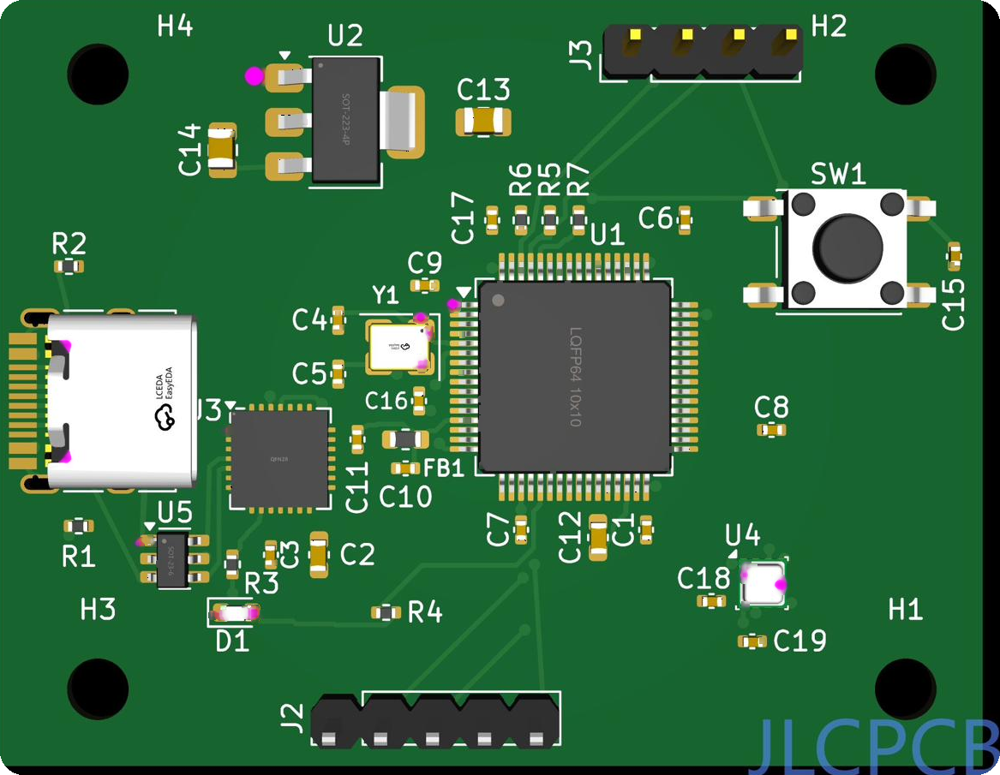
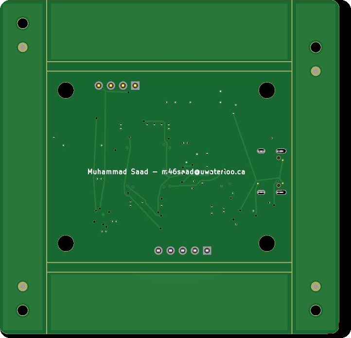

# STM32F411 Sensor Telemetry Board — Firmware

Bare-metal C (no HAL, direct CMSIS) + FreeRTOS firmware for a custom **4-layer** STM32F411RET6
sensor telemetry board. A BME280 environmental sensor and a 128×64 **SSD1306 OLED** share one
400 kHz I²C bus, arbitrated by a FreeRTOS mutex. Sensor readings are framed with a CRC-16/CCITT
protocol and streamed at 921600 baud over a CP2102N USB-UART bridge to a Python visualizer.

<p align="center">
  
  
</p>

## Architecture — four FreeRTOS tasks
- **sensor_task** — reads + Bosch-compensates the BME280 over I²C, pushes samples to a queue
- **telemetry_task** — builds the CRC-framed binary packet and sends it under a UART mutex
- **display_task** — renders pages to the SSD1306; a **PA0/EXTI0 button** cycles pages via an ISR notification
- **heartbeat_task** — blinks the PA5 LED and kicks the IWDG watchdog

Shared I²C access is protected by an `i2c_mutex`; an `i2c_bus_recovery()` routine frees a wedged bus.

## Hardware (locked spec)
- MCU: **STM32F411RET6, LQFP-64** (LCSC C94355)
- PCB: **4-layer** — `F.Cu` signal / `In1.Cu` ground plane / `In2.Cu` +3V3 plane / `B.Cu` signal, 1.6 mm FR4
- BME280 @ I²C **0x77** (SDO→+3V3) · SSD1306 @ I²C **0x3C** · CP2102N USB-UART
- Clock: 8 MHz HSE → PLL → 100 MHz

## Layout
```
Core/Inc/   headers (clock, gpio, uart, i2c, bme280, crc, protocol, ssd1306, iwdg, FreeRTOSConfig)
Core/Src/   sources (+ main.c with the four tasks and the EXTI button ISR)
tools/      visualize.py — host-side telemetry viewer
hardware/   KiCad project (schematic, PCB, project)
docs/img/   board renders
```

## Build
Import into **STM32CubeIDE** as a bare-metal + FreeRTOS project for the STM32F411RET6
(develop on a NUCLEO-F411RE, deploy on the custom PCB). Flash over SWD/ST-Link.
