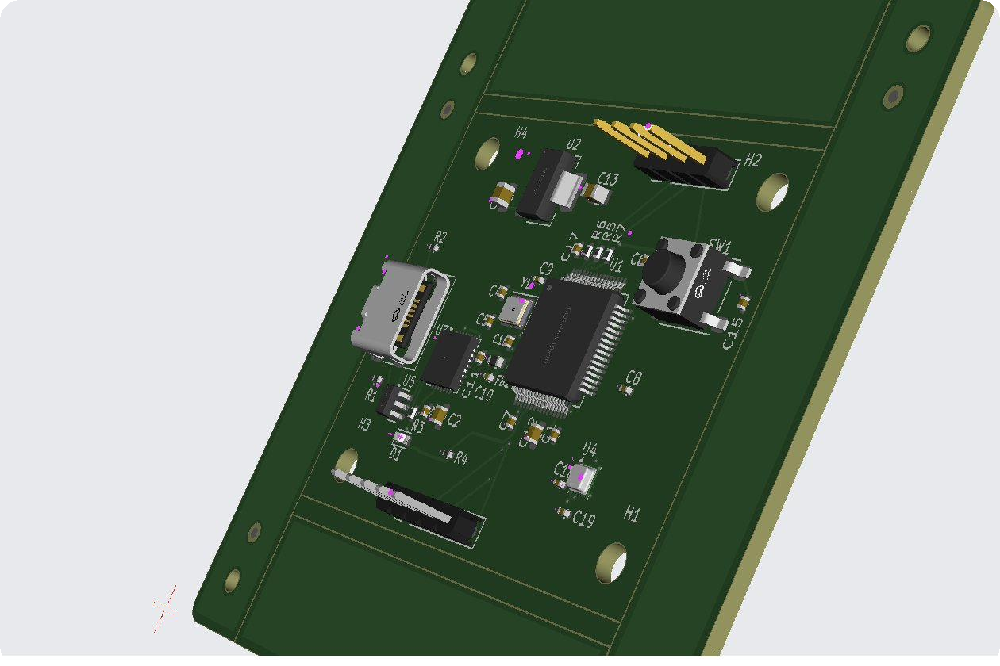

# STM32F411 Sensor Telemetry Board

A custom 4-layer board I designed and wrote the firmware for, end to end. It reads temperature, humidity, and pressure from a Bosch BME280 over I2C and streams the data as small, CRC-checked frames to my PC over USB, a few times a second, with a tiny real-time OS keeping three jobs running at once. Every line of firmware is bare-metal, written from the register level, with no vendor HAL doing the hard parts.

This is a personal learning project. I took it on to understand embedded properly, from drawing the schematic to bringing up the clock tree by hand, and I keep iterating on it as I learn.

<p align="center">
  
</p>
<p align="center">
  
  &nbsp;&nbsp;
  
</p>
<p align="center"><sub>Custom 4-layer board: STM32F411 + BME280 + CP2102N USB-UART. 3D renders of the design.</sub></p>

## What it does

- Samples a BME280 (temperature, humidity, pressure) on a fixed cadence over a 400 kHz I2C bus.
- Packs each reading into a 21-byte binary frame protected by a CRC-16/CCITT checksum.
- Streams the frames over UART at 921600 baud, through an onboard CP2102N USB-to-UART bridge, so the board shows up on the PC as a standard COM port.
- Runs three concurrent FreeRTOS tasks (sensor, telemetry, heartbeat) on a hand-configured 100 MHz clock, so the main path never blocks.
- A host-side Python tool validates each frame's CRC, prints the readings, optionally live-plots them, and logs to CSV.

### Why a USB-to-UART bridge instead of native USB

Native USB-CDC firmware on an STM32 is genuinely hard: descriptors, endpoints, enumeration, a big state machine, and a class of timing bugs that eat a week. A CP2102N is a small chip that is itself a USB device and hands the STM32 a clean UART. To the PC the board is a COM port either way. That scopes out a large source of risk and complexity while losing nothing the telemetry needs. It is a deliberate design choice, and I think the right one for this board.

## Architecture

```
  BME280  --I2C (400 kHz)-->  sensor_task  --queue-->  telemetry_task  --UART (921600)-->  CP2102N  --USB-->  host PC
                                   |                          |                                                    |
                                 reads &                   builds CRC-16                                     visualize.py
                                 compensates               framed packet                                  (validate, plot, CSV)

  heartbeat_task --> blinks the LED at 1 Hz so the scheduler is visibly alive
```

- **sensor_task** (priority 2) owns the I2C bus, reads and compensates a sample every 250 ms, and pushes it to a queue (non-blocking, drops if full).
- **telemetry_task** (priority 1) blocks on the queue, builds a CRC-framed packet, and sends it under a UART mutex.
- **heartbeat_task** (priority 1) toggles the LED, so preemption is visible at a glance.
- A **queue** decouples producer from consumer; a **mutex** guards the shared UART.

## Firmware highlights

The parts I am most proud of, and the ones I can explain end to end.

- **Register-level I2C master (`i2c.c`).** Implements the STM32F4 I2C v1 event model by hand: START, address, the ADDR-clear read-SR1-then-SR2 sequence, and the separate N=1 / N=2 / N>=3 receive paths with correct ACK/NACK and STOP timing per RM0383. Every wait is bounded by a timeout so one wedged slave cannot hang the task; transfers return 0 / -1 (timeout) / -2 (address NACK).
- **Hand-configured clock tree (`clock.c`).** Brings the system to exactly 100 MHz from an 8 MHz crystal (PLL M=8, N=200, P=2), raising flash wait states first and setting bus prescalers before the switch so no bus is ever over-clocked.
- **BME280 driver (`bme280.c`).** Reads the per-chip calibration, configures normal mode, and runs the Bosch fixed-point compensation math (including the 64-bit pressure path) to produce engineering units.
- **CRC-framed protocol (`crc.c`, `protocol.c`).** A 21-byte little-endian frame with a CRC-16/CCITT over the length and payload; the Python host recomputes the identical CRC to reject corruption.
- **FreeRTOS integration (`main.c`, `FreeRTOSConfig.h`).** Three tasks, a queue, a mutex, deliberate priorities and stack sizes, and the SVC/PendSV/SysTick handlers routed to the kernel so preemption works.

## Repository layout

```
stm32-sensor-telemetry-board/
├── Core/
│   ├── Inc/   clock.h gpio.h uart.h i2c.h bme280.h crc.h protocol.h FreeRTOSConfig.h
│   └── Src/   main.c clock.c gpio.c uart.c i2c.c bme280.c crc.c protocol.c stm32f4xx_it.c
├── tools/     visualize.py, requirements.txt
├── hardware/  KiCad 4-layer project (schematic + PCB)
└── docs/img/  board renders
```

The CMSIS device header (`stm32f4xx.h`), the startup file, and the FreeRTOS kernel sources are vendor and third-party components, added through STM32CubeIDE and the FreeRTOS distribution at build time rather than committed here.

## Building and flashing

The firmware targets the STM32F411 and is organized to build under STM32CubeIDE or a bare arm-none-eabi-gcc toolchain. The same code is set up to build for either the custom board or a NUCLEO-F411RE dev board.

1. Create an STM32F411 project and add the FreeRTOS kernel (CM4F port + `heap_4`).
2. Drop in the files from `Core/Src` and `Core/Inc`.
3. Use the `FreeRTOSConfig.h` here. It maps `SVC_Handler`, `PendSV_Handler`, and `SysTick_Handler` to the kernel, so make sure no other file also defines those three, or you get a multiple-definition link error.
4. Keep a real `HardFault_Handler` body so faults trap in the debugger.
5. Build, then flash over SWD with an ST-LINK.

On a NUCLEO, wire a BME280 breakout to PB8 (SCL) and PB9 (SDA); telemetry comes out on the board's virtual COM port.

## Host visualizer

```bash
cd tools
pip install -r requirements.txt

python visualize.py /dev/ttyUSB0          # or COM5 on Windows; prints + logs to CSV
python visualize.py /dev/ttyUSB0 --plot   # add a live matplotlib plot
```

It resynchronizes on the start byte, checks the markers, length, and CRC, and silently drops any corrupt or misaligned frame. That dropping is the CRC doing its job.

### Telemetry frame (21 bytes, little-endian)

| Bytes | Field | Notes |
|-------|-------|-------|
| 0 | start | `0xAA` |
| 1 | length | `16` (payload length) |
| 2..5 | seq | u32 sequence number |
| 6..9 | temperature | i32, units of 0.01 C |
| 10..13 | pressure | u32, Pa |
| 14..17 | humidity | u32, units of 0.01 %RH |
| 18..19 | CRC-16/CCITT | over bytes 1..17 |
| 20 | end | `0x55` |

## Notes

This is a living project, so I treat it as a work in progress and keep refining it: cleaning up the drivers, tightening the board, and growing the host tooling as I pick up new things. If you would do something differently, I am genuinely interested to hear it.

## Tech stack

C (bare-metal, CMSIS, no HAL) · FreeRTOS · STM32F411 (Cortex-M4F) · I2C · UART · BME280 · CRC-16/CCITT · KiCad (4-layer PCB) · Python (pyserial, matplotlib)

## License

MIT. See [LICENSE](LICENSE).
